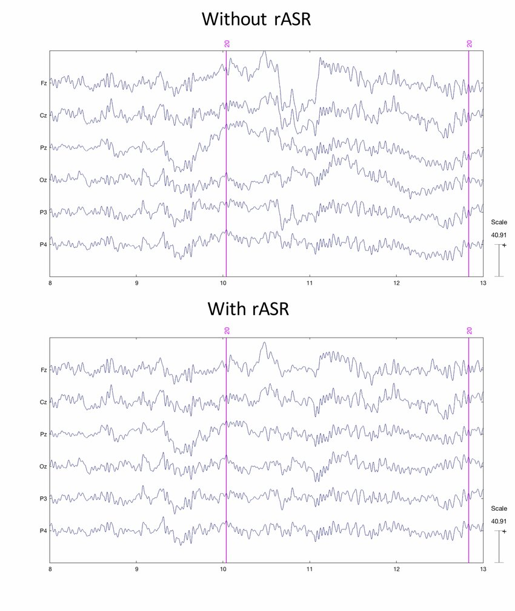

# Artifact Subspace Reconstruction (ASR)

Artifact Subspace Reconstruction (ASR) is another technique used in EEG data preprocessing to remove artifacts and noise from the recorded signals. ASR is particularly effective in handling transient artifacts, such as muscle movements or eye blinks, which can significantly distort EEG data.

For instance, in our workflow, we utilize ASR in the `filter.ipynb` notebook to clean the raw EEG data. This step is crucial for ensuring that the subsequent analyses and model training are based on high-quality data.

{ width=600 }
/// caption
Taken from https://www.researchgate.net/publication/336111967_Monitoring_auditory_attention_with_a_6_dry-electrode_EEG_system_in_real_flight_conditions
///

!!! question "RASR?"

    RASR, or Riemannian Artifact Subspace Reconstruction, is an advanced version of ASR that leverages Riemannian geometry for improved artifact removal. In short, it is a modified version of ASR.

As you see above, ASR effectively identifies and removes artifacts from the EEG signals, resulting in cleaner data that better represents the underlying neural activity. This cleaned data is then saved to the `processed/` directory for further analysis and processing in subsequent steps of our workflow.

## To Implement ASR

To implement ASR in your EEG data preprocessing pipeline, there exists libraries such as [ASRpy](https://github.com/DiGyt/asrpy){:target="\_blank"} that provide functionalities to apply ASR to EEG datasets. These libraries typically require you to specify parameters such as the cutoff threshold for artifact detection and the window size for reconstruction.

Currently, MNE is working on integrating ASR into their library, which will make it easier for users to apply ASR directly within the MNE framework. (Their GitHub issue can be found [here](https://github.com/mne-tools/mne-python/pull/9302){:target="\_blank"})

Check out the `Resources` section for more in-depth materials on ASR and its applications in EEG data preprocessing.
