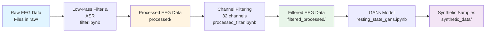

# Current Workflow

The current workflow for the AMPLAB Digital Twins Project involves several key steps, which are outlined below:

1.  Data Acquisition: Collect raw EEG data from the Healthy Brain Network (HBN) dataset (release 10). Ensure that all raw data files are placed in the `raw/` directory.

2.  Data Preprocessing: Use the `filter.ipynb` and `processed_filter.ipynb` notebooks to preprocess the raw EEG data.

    !!! info "Notebooks Used"

        - `filter.ipynb`: Performs low-pass filtering and artifact removal using ASR. (Saves to `processed/` directory)
        - `processed_filter.ipynb`: Performs channel selection and further filtering of processed data. (Saves to `filtered_processed/` directory)

3.  Task Separation: Utilize the `separate_tasks_resting_state.ipynb` notebook to separate different tasks (e.g., eyes open vs. eyes closed) from the resting-state EEG data.

4.  GAN Training: Train GAN models on the resting-state EEG data using the `resting_state_gans.ipynb` notebook. The generated models will be saved in the `gan_data/` directory.

---

## Workflow Visualization

Above is our current workflow for processing EEG data and training GAN models. All of these steps are listed to be of the data-preprocessing step of our project.

Research being research, feel free to modify and adapt the workflow as needed for your experiments!
