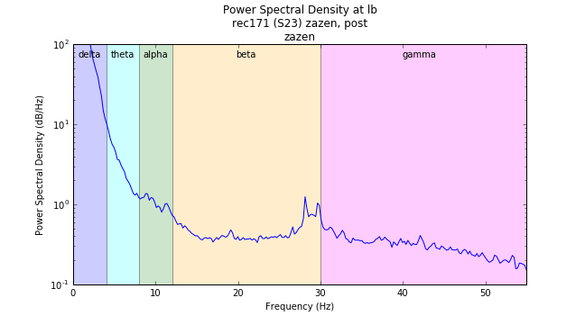

# EEG Data and How to Interpret It

EEG data consists of time-series recordings of electrical activity from multiple electrodes placed on the scalp. Each electrode captures voltage fluctuations over time, resulting in a multi-channel dataset that reflects the brain's dynamic activity.

## How to obtrain EEG Data

EEG data can be easily obtained through various means: as of Fall, 2025, we're using Healthy Brain Network's (HBN) open EEG dataset (release 10) which can be found [here](https://nemar.org/dataexplorer/detail?dataset_id=ds005515){:target="\_blank"}. This dataset includes EEG recordings from a large number of participants, along with relevant metadata such as age, sex, and clinical assessments.

Doing this research, we're focused on classifying and predicting people's brain state given some EEG data. This is the entire goal of Digital Twins, which is to create a digital representation of an individual's brain state based on their EEG data. This can be useful for a variety of applications, such as diagnosing neurological disorders, monitoring cognitive states, and developing brain-computer interfaces.

When working with EEG data, it's important to preprocess the data to remove artifacts (e.g., eye blinks, muscle activity) and to filter the signals to focus on specific frequency bands of interest (e.g., delta, theta, alpha, beta, gamma). After preprocessing, various analysis techniques can be applied, such as time-frequency analysis, connectivity analysis, and machine learning algorithms for classification and prediction tasks.

# Different Bands

EEG signals are typically analyzed in terms of different frequency bands, each associated with specific cognitive and physiological states. The main EEG frequency bands are:

- **Delta (0.5 - 4 Hz)**: Associated with deep sleep and restorative processes.
- **Theta (4 - 8 Hz)**: Linked to drowsiness, meditation, and light sleep.
- **Alpha (8 - 13 Hz)**: Related to relaxed wakefulness and closed-eye states.
- **Beta (13 - 30 Hz)**: Connected to active thinking, focus, and problem-solving.
- **Gamma (30 - 100 Hz)**: Involved in higher cognitive functions, such as perception and consciousness.

!!! note "Useful Note"

    Anything relatively above 50 Hz is often considered noise and is usually filtered out during preprocessing (i.e. artificial electrical signals from muscle movement or external electronic devices).

# Power Spectral Density (PSD)

Let's explore a fundamental part of EEG data analysis: Power Spectral Density (PSD) plots. PSD plots help us visualize how the power of the EEG signal is distributed across different frequency bands. By examining these plots, we can identify dominant frequencies and assess the overall brain activity.

Power Spectral Density is a measure of the power present in the EEG signal as a function of frequency. It provides insights into the strength of various brain wave components and helps in understanding the underlying neural dynamics.

{ width=600 }
/// caption
Taken from https://still-breathing.net/tag/eeg/
///

As you can see from the above example, the x-axis represents frequency (in Hz), while the y-axis indicates power (in µV²/Hz). Peaks in the PSD plot correspond to dominant frequency bands, which can be linked to specific cognitive states or neurological conditions.

At the lower end of the frequency spectrum, we often observe higher power in the delta and theta bands, which are associated with sleep and relaxation. As we move towards higher frequencies, the alpha and beta bands become more prominent, reflecting alertness and cognitive engagement.

With these changes in power across different frequency bands, we can infer various aspects of brain function and identify potential abnormalities. For instance, an increase in theta power may indicate drowsiness, while elevated beta activity could suggest heightened cognitive processing.

# Real Example

Let's use one of HBN's EEG recordings to illustrate how to interpret EEG data. Below is a sample EEG signal from a participant during a resting-state session.
